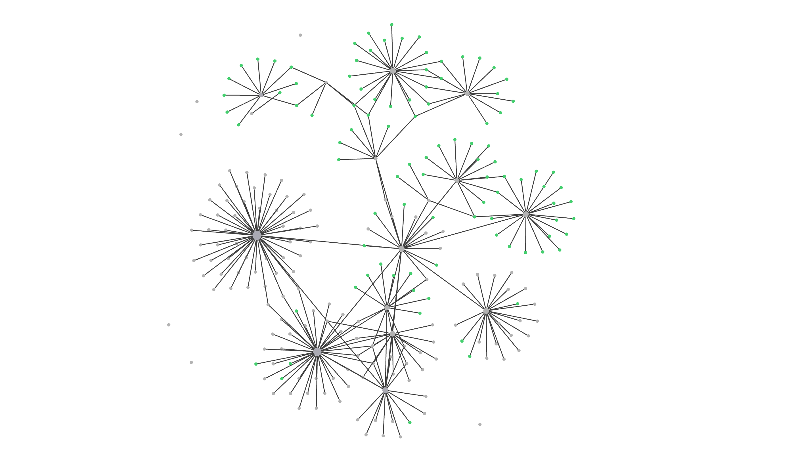

# Concepts of Programming Languages

This repo contains notes and a map built in Obsidian. This repo can be cloned and opened as a vault in Obsidian, then open graph view to see the mind-map built be the collective notes.

This repo will be continously growing. As of now it contains Chapter 1, 3, and 4 of the textbook.
