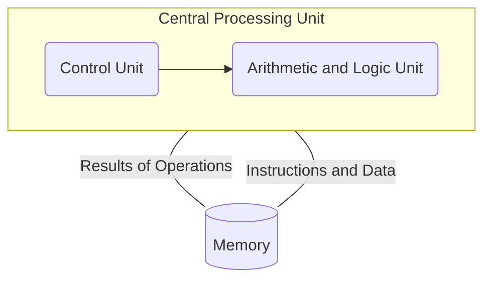

In addition to the factors described in [[1.3]], several other factors influence the basic design of programming languages. The most important of these are computer architecture and programming design methodologies.

## Computer Architecture

The basic architecture of computers has had a profound effect on language design. Most of the popular languages of the past 60 years have been designed around the prevalent computer architecture, called the #von-Nuemann architecture, after one of its originators, John von Neumann. These languages are called #imperative languages. In a #von-Nuemann computer, both data and programs are stored in the same memory. 

The central processing unit (CPU), which executes instructions, is separate from the memory. Therefore, instructions and data must be transmitted, or piped, from memory to the CPU. Results from the CPU must be returned to memory. Nearly all digital computers built since the 1940s have been based on the #von-Nuemann architecture. 



Execution of machine code on a #von-Nuemann computer occurs in a process called the #fetch-execute-cycle. Each instruction to be executed must be moved from memory to the processor. The address of the next instruction to be executed is maintained in a register called the #program-counter. The #fetch-execute-cycle can be simply described with the following algorithm:

```c
repeat forever
	fetch the instruction pointed to by the program counter
	
	increment the program counter to point at the next instruction
	
	decode the instruction
	
	execute the instruction
end repeat
```

The "decode the instruction" step in the algorithm means the instruction is examined to determine what action it specifies. 

A #functional, or #applicative, language is one in which the primary means of computation is applying functions to given parameters. Programming can be done in a #functional language without the kind of variables that are used in #imperative languages, without assignment statements, and without iteration. 

While there are a myriad of benefits of #functional languages, such as #Scheme, it is unlikely that they will displace the #imperative languages until a non-von Neumann computer is designed that allows efficient execution of programs in functional languages.


